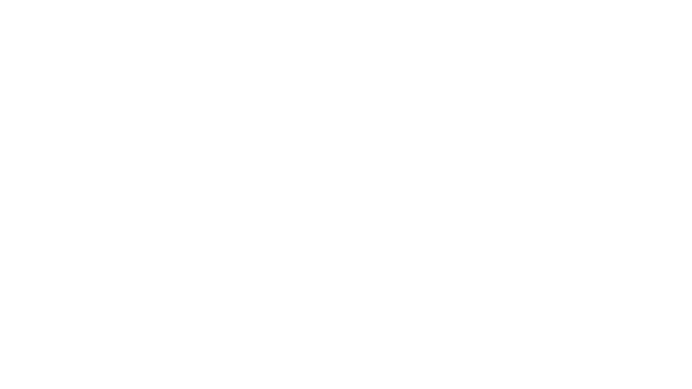
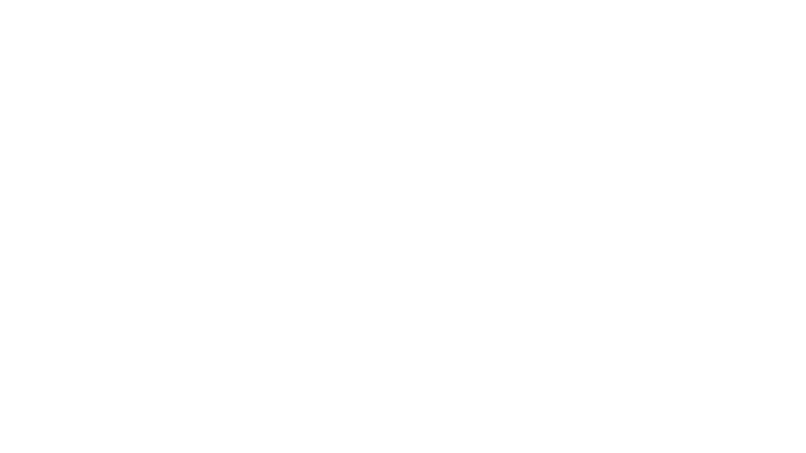
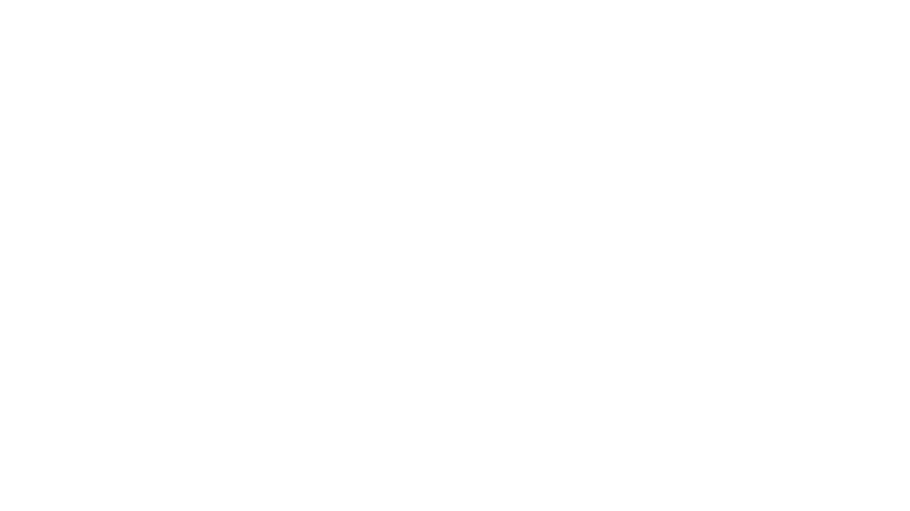
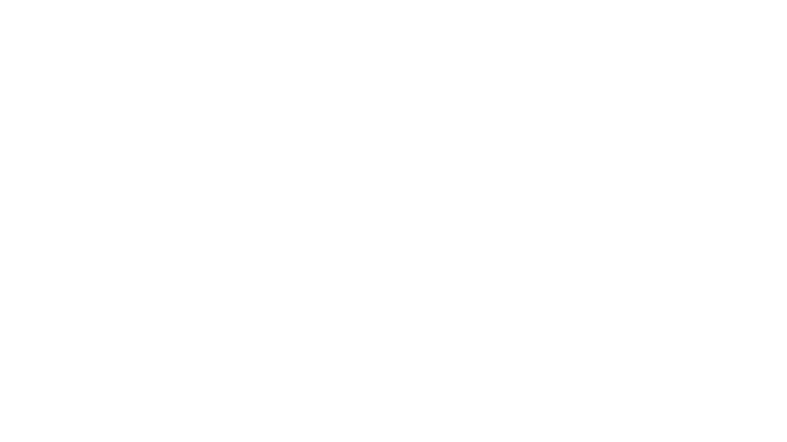
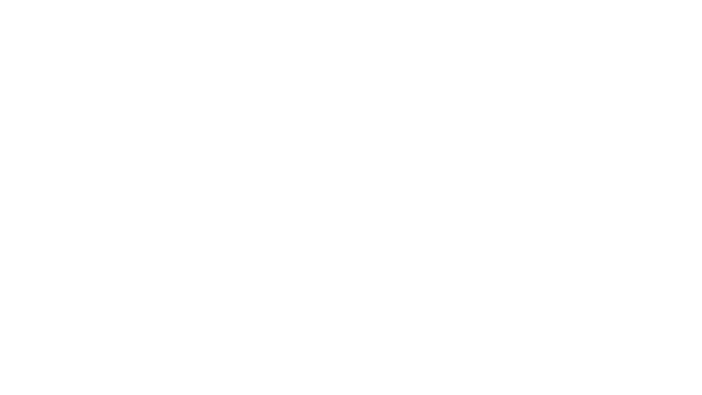
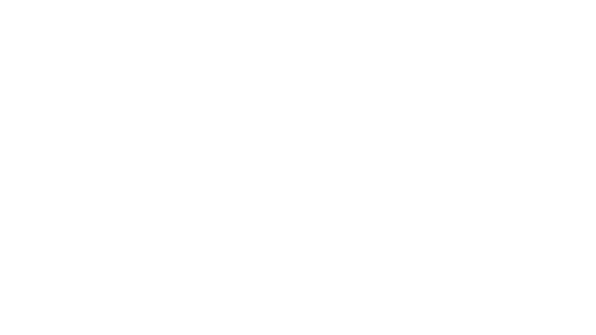
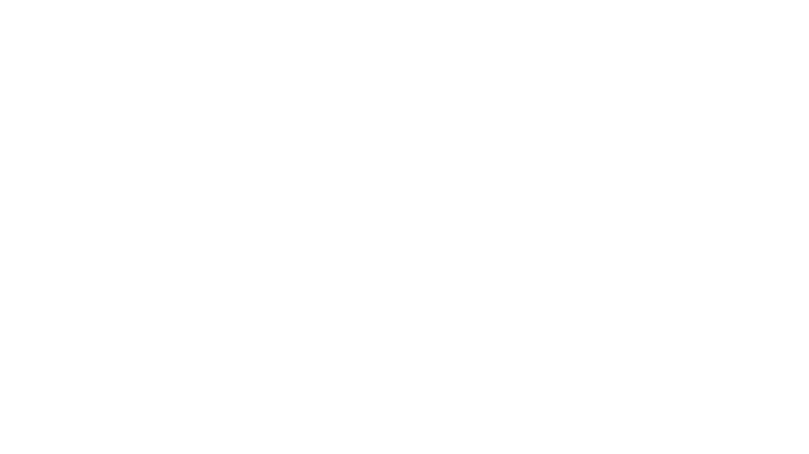
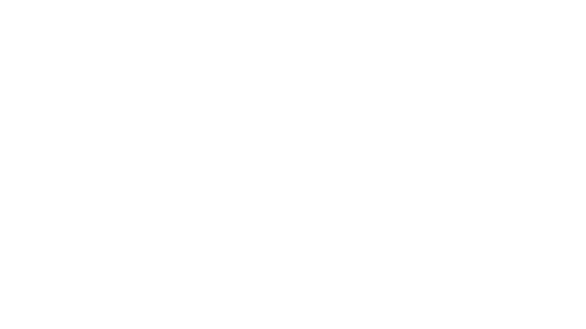

# @ezmenus/shadcn-libra

Universal block library for the EzMenus projection registry. Part of the locked UI layer that renders deterministic surface manifests.

## Component Catalog

All blocks are universal — they accept generic props and are bound to industry data via the projection registry's `module-bindings.json`.

### Hero Identity Block

Primary above-the-fold identity block. Displays title, description, image, rating, and call-to-action buttons.



**Props:**

| Prop | Type | Required | Description |
|------|------|----------|-------------|
| `title` | string | Yes | Business name |
| `description` | string | Yes | Tagline or description |
| `subtitle` | string | No | Category or slogan |
| `image` | string | No | Hero image URL |
| `rating` | string | No | Star rating or aggregate score |
| `priceRange` | string | No | Price indicator ($$, $$$, etc.) |
| `badge` | string | No | Featured or top-rated badge |

---

### Contact Location Card

Displays address, contact methods, map link, and hours.



**Props:**

| Prop | Type | Required | Description |
|------|------|----------|-------------|
| `address` | string | Yes | Physical address |
| `phone` | string | No | Phone number |
| `email` | string | No | Email address |
| `mapUrl` | string | No | Link to Google/Apple Maps |
| `neighborhood` | string | No | Area or district |
| `hours` | string | No | Opening hours |

---

### Amenity Grid

Displays a responsive grid of features, amenities, or services.



**Props:**

| Prop | Type | Required | Description |
|------|------|----------|-------------|
| `items` | string[] | Yes | Array of amenity names |
| `title` | string | No | Section title (default: "Amenities") |
| `intro` | string | No | Introductory text |
| `columns` | 2 \| 3 \| 4 | No | Grid columns (default: 3) |

---

### Booking Summary Card

Compact card for reservation or booking information.



**Props:**

| Prop | Type | Required | Description |
|------|------|----------|-------------|
| `primaryLabel` | string | Yes | Business name or card title |
| `checkin` | string | No | Check-in time or date |
| `checkout` | string | No | Check-out time or date |
| `rooms` | number \| string | No | Rooms available |
| `priceRange` | string | No | Price range |
| `languages` | string[] | No | Spoken languages |
| `ctaLabel` | string | No | Button text (default: "Check Availability") |

---

### Gallery Grid

Image gallery with optional captions and hover zoom.



**Props:**

| Prop | Type | Required | Description |
|------|------|----------|-------------|
| `images` | GalleryImage[] | Yes | Array of { src, alt, caption? } |
| `title` | string | No | Section title (default: "Gallery") |
| `columns` | 2 \| 3 \| 4 | No | Grid columns (default: 3) |

---

### Testimonial Strip

Customer reviews displayed as cards in grid or carousel layout.



**Props:**

| Prop | Type | Required | Description |
|------|------|----------|-------------|
| `testimonials` | Testimonial[] | Yes | Array of { text, author, rating?, date? } |
| `title` | string | No | Section title |
| `variant` | "grid" \| "carousel" | No | Layout style (default: "grid") |

---

### CTA Section

Call-to-action banner with button, optional background image.



**Props:**

| Prop | Type | Required | Description |
|------|------|----------|-------------|
| `title` | string | Yes | Headline text |
| `ctaLabel` | string | Yes | Button text |
| `description` | string | No | Supporting text |
| `ctaUrl` | string | No | Button link |
| `variant` | "default" \| "centered" \| "split" | No | Layout variant |
| `backgroundImage` | string | No | Background image URL |

---

### Footer Block

Multi-column footer with navigation links and social media.



**Props:**

| Prop | Type | Required | Description |
|------|------|----------|-------------|
| `businessName` | string | Yes | Business legal name |
| `columns` | FooterColumn[] | No | Navigation columns with { title, links[] } |
| `socialLinks` | FooterLink[] | No | Social media links |
| `copyright` | string | No | Copyright text |

---

## Industry Bindings

These blocks receive props from industry bindings. For example, a hotel maps:

```json
{
  "title": "Hotel.name",
  "subtitle": "Hotel.slogan",
  "rating": "Hotel.aggregateRating"
}
```

A restaurant maps differently using the same block:

```json
{
  "title": "Restaurant.name",
  "subtitle": "Restaurant.servesCuisine",
  "rating": "Restaurant.aggregateRating"
}
```

## Development

```bash
npm install
npm run storybook
npm run build
```

## License

MIT
